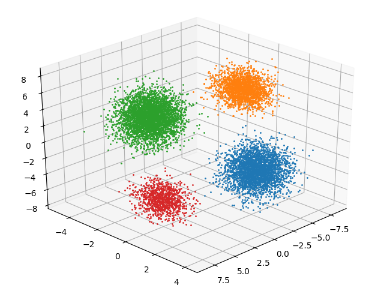

# EM algorithm
In `./em_algorithm`, run
```
python main.py x.csz z.csv params.dat --figure
```
'x.csv' is input data csv file, 'z.csv' is output posterior probabilities, and 'params.dat' is parameters of each cluster.
'--figure' is optional, we can check 3D graph of the data colored by each class.

# Gibbs sampling
In `./gibbs`, run
```
python main.py x.csz z.csv params.dat --figure
```
x.csv is input data csv file, z.csv is output posterior probabilities, and params.dat is parameters of each cluster.
'--figure' is optional, we can check 3D graph of the data colored by each class.

If you encountered with numpy.linalg error, this is caused by unsuitably sampled initial value.
Please try sometimes to avoid this error.

# appropriate K

We can also check the fact by drawing data on a 3D graph

